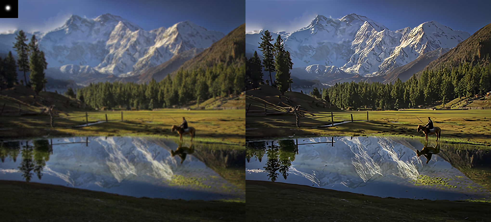
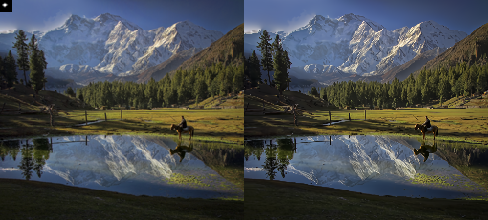

# BLIND USRNET

A project in Statistical Image Processing.
Extension of [Deep unfolding network for image super-resolution](https://arxiv.org/pdf/2003.10428.pdf) 
for Blind Super Resolution via [Kernel Estimation](https://arxiv.org/abs/1909.06581) 

In this project we aim to extend USRNet [1] for Blind Super Resolution. We
added a step of blind kernel estimation [2] and noise STD estimation [3] algorithm. These additions show SoTA performance in Blind-SR

This code borrows heavily from [1] & [2], see the papers and code in the Acknowledgment section.


## Getting Started

Clone the Repo:  
```bash
git clone https://github.com/geopi1/Improved_USRNet.git
```

### Datasets
Download the Datasets (a bicubically downscaled version of DIV2K):

[Download DIV2K](https://drive.google.com/drive/folders/1wITaNr7KNg_keUnK4myKjUoKA4HGeONA?usp=sharing)  
This link will download 2 folders:
* DIV2K_LR - the low resolution input
* DIV2K_HR_ds2 - Ground truth high resolution images

### Prerequisites
Tested and run on:  
 * UBUNTU 18.04  
 * RTX 2080  
 * Nvidia driver 440.95.10  
 * cuda 10.1.243  
 * cudnn 7.6.5  
 * pytorch 1.5  
 * TF 1.14
 
 
1. Setup conda 
    ```bash
    conda env create -f env.yml
    ```
    This will create a working environment named Blind_USRNet
2. Setup can also be performed with pip (virtual env) via the requirements.txt file 
    ```bash
    python -m venv Blind_USRNet
    pip install -r requirements.txt
    ```
3. put images in right place

## Testing
### Code
```bash
python main.py 
```
This will output 4 types of images to ./results: 
* Default USRNet settings
* Default USRNet settings + Noise STD estimation
* Kernel estimated USRNet
* Kernel estimated USRNet + Noise STD estimation

Additionally, for each estimated image a side-by-side image with the LR version is saved with the degredation kernel (default or estimated)  

### Numerical Evaluation
To calculate the numeric results on the whole dataset run:
```bash
python utils/get_results.py
```
This will calculate the mean PSNR and SSIM on the SR<->HR on all the results

## Numerical Results
| Metric        | Default | Default + Noise Est. | Kernel Est. | Kernel Est. + Noise Est. |
| ------------- | ------- | -------------------- | ----------- | ------------------------ |
| PSNR          |         | $1600 |              |             |                          |
| SSIM          |         |   $12 |              |             |                          |

## Visual Results





## License

This project is licensed under the MIT License - see the [LICENSE.md](LICENSE.md) file for details

## Acknowledgments
[1] Zhang, Kai, Luc Van Gool, and Radu Timofte. "Deep unfolding network for image super-resolution." Proceedings of the IEEE/CVF Conference on Computer Vision and Pattern Recognition. 2020.

[2] Bell-Kligler, Sefi, Assaf Shocher, and Michal Irani. "Blind super-resolution kernel estimation using an internal-gan." Advances in Neural Information Processing Systems. 2019.

[3] Chen G , Zhu F , Heng P A . "An Efficient Statistical Method for Image Noise Level Estimation" 2015 IEEE International Conference on Computer Vision (ICCV). IEEE Computer Society, 2015.